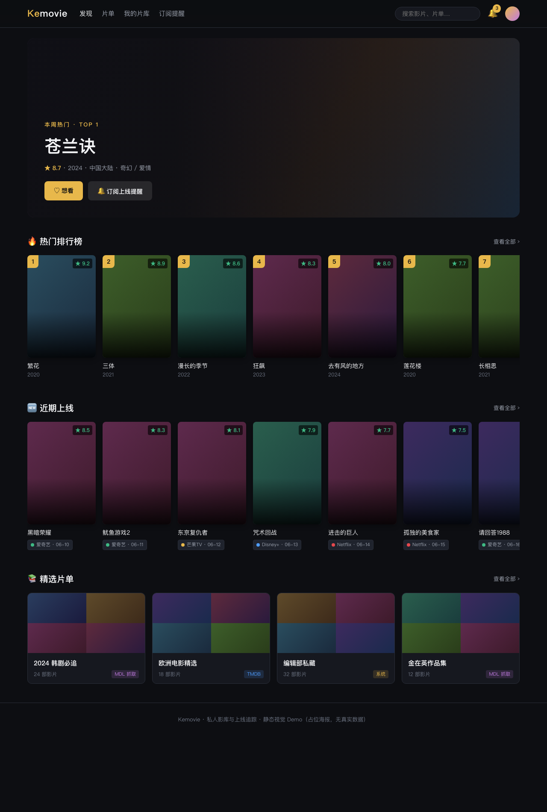

<p align="center">
	
</p>
<h1 align="center">影弯 Yingwans</h1>
<h4 align="center">私人影库 · 流媒体上线追踪 · 订阅提醒</h4>
<p align="center">
	
	
	
	
</p>

## 项目简介

影弯是一套自建的影视内容站点：自动聚合多来源片单与流媒体上线信息，会员可订阅影片，
上线或有资源时通过站内通知 / 微信公众号推送提醒。系统基于 RuoYi-Vue 二次开发，
包含门户前台、管理后台、定时采集与通知推送四个部分。

<p align="center">
	
</p>

## 核心功能

**门户前台**
- 首页：本周热门 Top5 轮播、最近收录、热门片单、浮动运营位
- 浏览筛选：年份 / 国家地区 / 评分（TMDB·站内·综合）/ 类别 / 播放平台 / 排序
- 影片详情：多平台观看信息、想看 / 看过 / 评分 / 订阅上线提醒
- 会员体系：注册登录、我的订阅、订阅动态

**内容与采集**
- TMDB：详情同步、图片（海报/剧照）下载转存
- MyDramaList：片单抓取（无头 Chrome 绕过 Cloudflare）
- JustWatch：香港 / 台湾 / 美国等区域最新上线，每小时巡检
- Letterboxd：官方片单抓取（slug 映射 + 标题匹配）
- 旧站迁移：从历史库 `mod_article` 导入影片与网盘资源，题材标签归类

**订阅与通知**
- 订阅影片后：上线即通知；资源就绪立即推送，未就绪则更新时自动通知全部订阅者
- 通知渠道：站内通知（一期）、微信公众号模板消息（二期，接口测试号即可）
- 资源安全：网盘资源不进前台接口，仅以飞书/腾讯文档链接按订阅投递，附免责声明

**后台管理**
- 影视库、片单、抓取源、订阅汇总/动态、想看列表、会员、流媒体服务商、运营位
- 图片存储支持本地或阿里云 OSS（自定义域名/CDN 回源）

## 技术栈

- 后端：Java 17 · Spring Boot · Spring Security(JWT) · MyBatis · Quartz · Redis
- 前端：Vue 2 · Element UI（后台）/ 自研门户主题（前台）
- 数据：MySQL 8（utf8mb4）· 无头 Chrome（CDP 渲染抓取）
- 存储：阿里云 OSS · 飞书开放平台（资源文档自动生成）

## 项目结构

```
├── ruoyi-admin        应用入口与运行配置（application-prod.yml.example）
├── ruoyi-kemovie      影弯业务模块（采集/订阅/通知/门户接口）
├── ruoyi-framework    框架核心（安全/配置）
├── ruoyi-system       系统域（用户/菜单/参数）
├── ruoyi-quartz       定时任务          ├── ruoyi-generator 代码生成
├── ruoyi-ui           前端（views/portal 门户 · views/kemovie 后台）
├── sql                建库与增量迁移脚本
├── tools              旧站数据导出脚本
└── doc/deploy         部署与运维文档
```

## 快速开始（本地开发）

```bash
# 1. 数据库：新建 utf8mb4 库，按 doc/deploy/README-deploy.md 第 3 节顺序执行 sql/
# 2. 后端（备好 application-druid.yml 数据源后）
mvn spring-boot:run -pl ruoyi-admin        # http://localhost:8080
# 3. 前端
cd ruoyi-ui && npm install && npm run dev  # 门户 / ，后台 /admin
```

第三方能力均为可选配置（在 `application*.yml` 或环境变量中设置）：
`OSS_ACCESS_KEY_ID/SECRET`（图片云存储）、`FEISHU_APP_ID/SECRET`（资源文档）、
`WECHAT_MP_APP_ID/SECRET`（模板消息）、`KEMOVIE_PROXY_ENABLED`（出网代理）。

## 生产部署

完整步骤见 [doc/deploy/README-deploy.md](doc/deploy/README-deploy.md)：jar 打包、前端构建、
Nginx 配置（HTTPS/反代）、进程守护、OSS 绑定自定义域名。

## 文档索引

- [服务器部署指南](doc/deploy/README-deploy.md)
- [飞书应用开通与配置](doc/deploy/feishu-setup.md)
- [微信公众号测试号配置](doc/deploy/wechat-sandbox-setup.md)
- [旧站数据导入计划](doc/deploy/import-legacy-plan.md)
- [MySQL 误删数据恢复手册（binlog）](doc/deploy/mysql-binlog-recovery.md)

## 声明

本项目仅供个人学习、研究与交流使用。站内不存储、不制作、不上传任何影视资源；
所有信息均来自互联网公开渠道，若涉及侵权请联系删除。

## 致谢

基于 [RuoYi-Vue](https://gitee.com/y_project/RuoYi-Vue) 快速开发平台构建。
